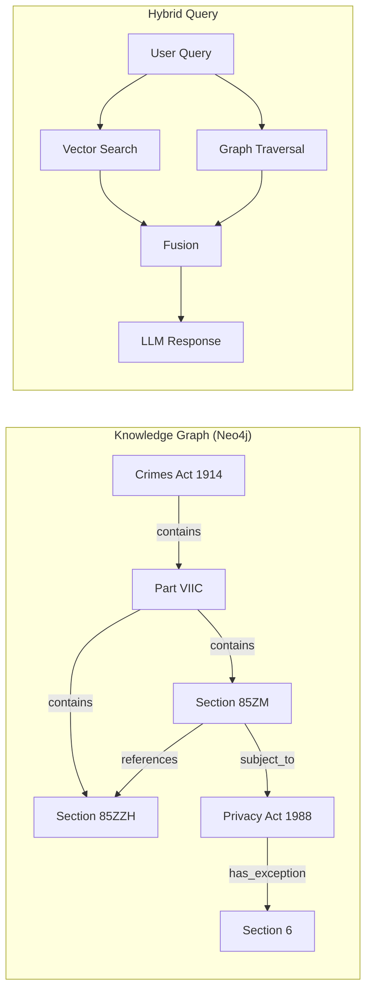

# GraphRAG Roadmap — Knowledge Graph for Australian Legal Data

## Tầm nhìn 6-12 tháng

### Vấn đề
Vector DB (PGVector) tìm kiếm theo **độ giống nhau của chữ**. Nhưng luật pháp là **mạng lưới quan hệ**:

> "Theo Khoản 2, áp dụng hình phạt tại Mục 15 của Đạo luật X, ngoại trừ trường hợp tại Phụ lục A"

Vector search KHÔNG thể móc nối 3 mảnh thông tin này. GraphRAG có thể.

---

## Kiến trúc đề xuất



## Neo4j Schema

```cypher
// Nodes
(:Act {name, jurisdiction, status, year})
(:Part {number, title, act_name})
(:Division {number, title})
(:Section {number, title, content, status, effective_date})
(:Topic {name})

// Relationships
(Act)-[:CONTAINS]->(Part)
(Part)-[:CONTAINS]->(Division)
(Division)-[:CONTAINS]->(Section)
(Section)-[:REFERENCES]->(Section)     -- Cross-references
(Section)-[:AMENDS]->(Section)         -- Amendments
(Section)-[:SUBJECT_TO]->(Section)     -- Exceptions
(Section)-[:ABOUT]->(Topic)            -- Topic classification
(Act)-[:REPEALED_BY]->(Act)            -- Repeal tracking
```

## Multi-hop Reasoning Example

**Query:** "Can a spent conviction under Commonwealth law affect a Working with Children Check in NSW?"

**Graph traversal:**
1. Start: `Crimes Act 1914 (Cth) → Part VIIC → Section 85ZZH`
2. Traverse: `Section 85ZZH -[:HAS_EXCEPTION]-> WWCC exclusions`
3. Cross-reference: `Child Protection (WWC) Act 2012 (NSW) → Section 5`
4. Result: "Section 85ZZH of the Crimes Act explicitly EXCLUDES spent convictions from WWCC checks..."

**Vector search alone** would only find fragments, not the full reasoning chain.

## Implementation Phases

### Phase 5.1: Relation Extraction Pipeline (Month 1-2)
- Use LLM to extract cross-references from legislation text
- Pattern: "pursuant to Section X" → `(current_section)-[:REFERENCES]->(X)`
- Store relations in JSONL before committing to Neo4j

### Phase 5.2: Neo4j Setup (Month 2-3)
- Deploy Neo4j instance (AuraDB free tier or self-hosted)
- Load nodes from PGVector metadata
- Load relations from extraction pipeline

### Phase 5.3: Hybrid Query Engine (Month 3-4)
- Modify retriever to query BOTH PGVector + Neo4j
- Fusion: Vector results weighted by graph distance
- Multi-hop traversal for cross-reference questions

### Phase 5.4: Evaluation & Tuning (Month 4-6)
- Compare GraphRAG vs Vector-only on legal reasoning benchmarks
- Measure multi-hop accuracy improvement
- Tune fusion weights

## Prerequisites
- [ ] Complete Trụ Cột 1-4 (data quality must be excellent first)
- [ ] Neo4j deployment decision (AuraDB vs self-hosted)
- [ ] Relation extraction prompt engineering
- [ ] Legal domain expert review of graph schema
